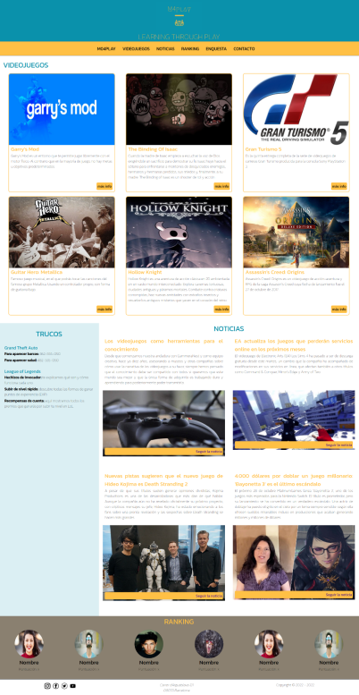
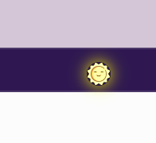
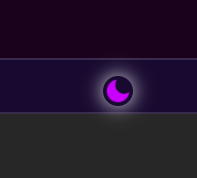
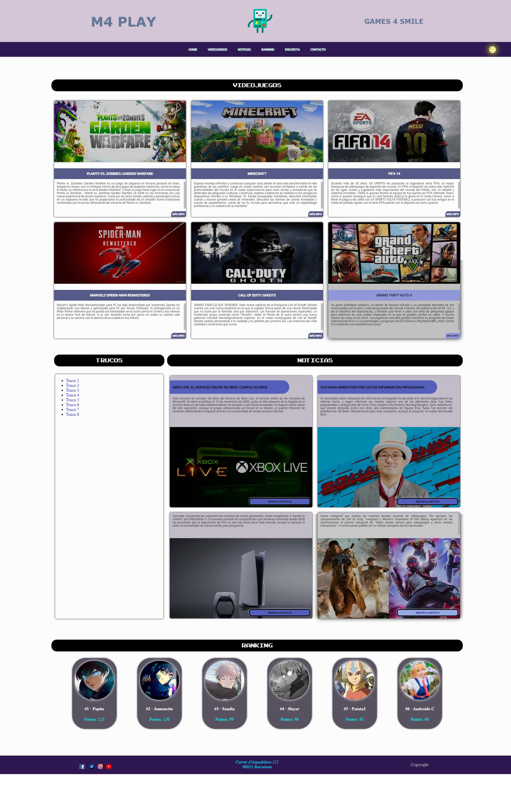

# Small Video Games Website
- [Small Video Games Website](#small-video-games-website)
  - [Intro](#intro)
- [Goals](#goals)
- [The Beginning](#the-beginning)
- [Added Features](#added-features)
- [How It Looks Like](#how-it-looks-like)
- [See More](#see-more)

## Intro
This is a **school-project** ([DAM](https://www.todofp.es/que-estudiar/loe/informatica-comunicaciones/des-aplicaciones-multiplataforma.html)v degree - 1st year) in Spain.

The objective was to develop a `Mobile First` website as a small video games store/database.

# Goals
Get a website with a similar structure and style to the following

**Main Page**\

**More pages:** _Video Games List_ - _News List_ - _Ranking (optional)_ - _Survey (optional)_ - _Contact_

# The Beginning
This was my first website created from zero, **only using** `HTML` and `CSS`

I was learning `CSS` while doing the website.\

# Added Features
I decided to add a button to toggle between **Light Mode** and **Dark Mode** only using `HTML` and `CSS`\

# How It Looks Like
This is a photo of the main page\

# See More
You can explore through my website here\
[M4 Play - Games 4 Smile](https://mcwally.github.io/SmallVideoGamesWeb/)
